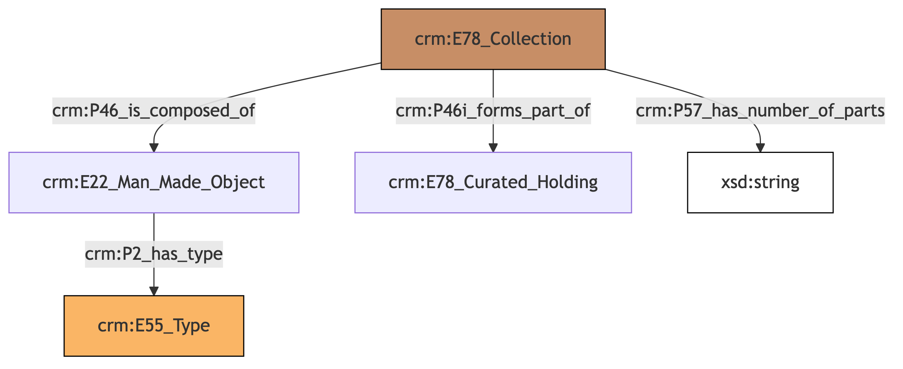
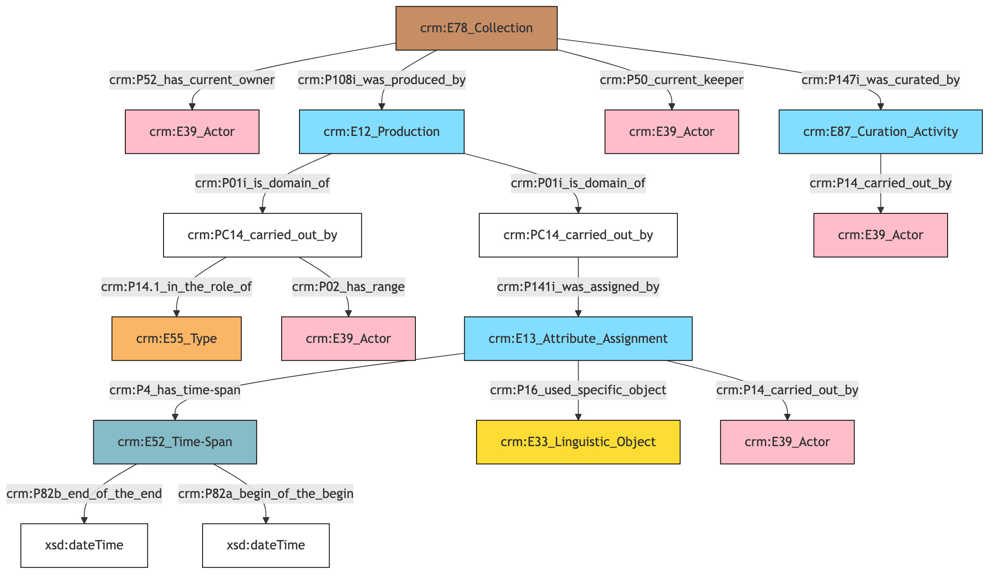
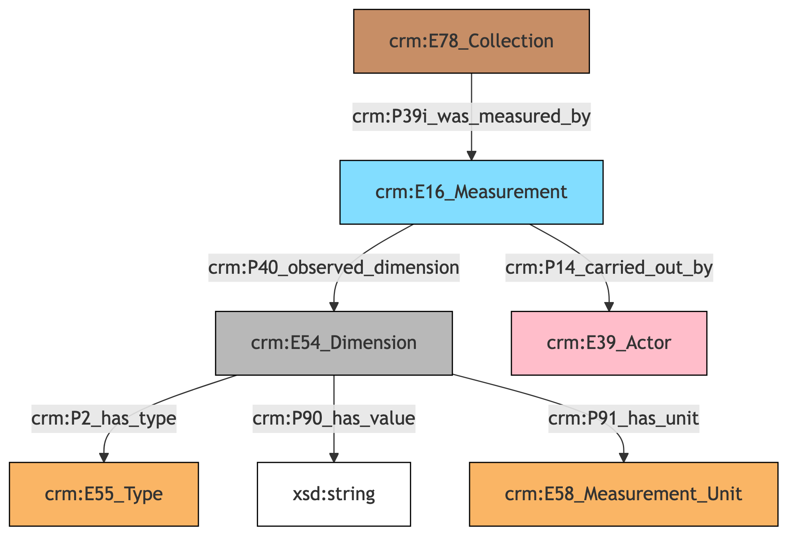
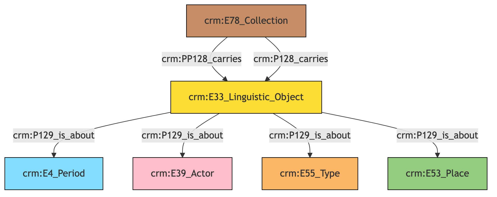
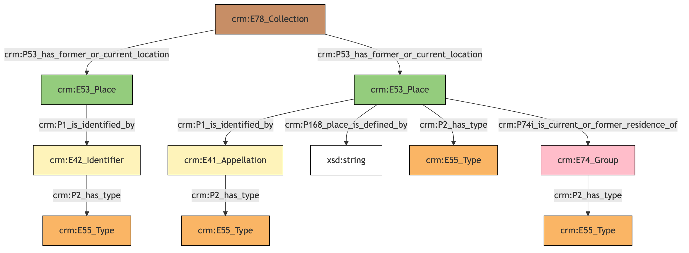
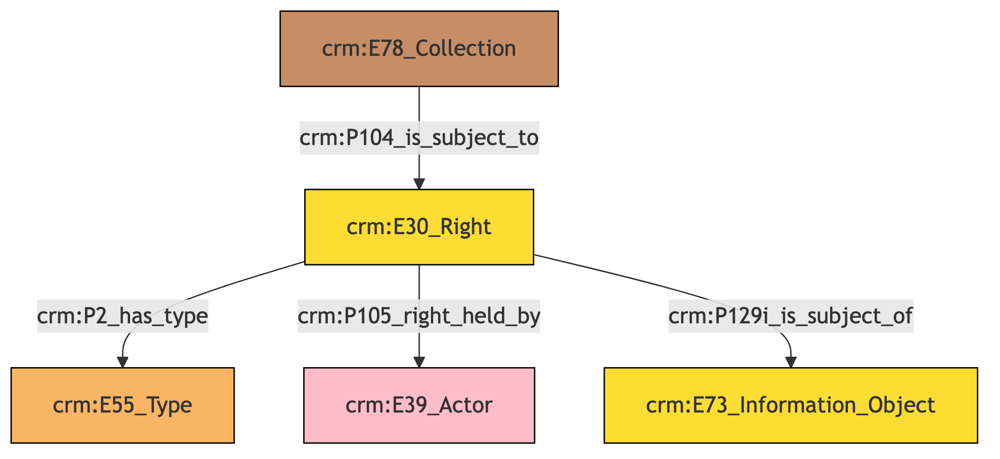
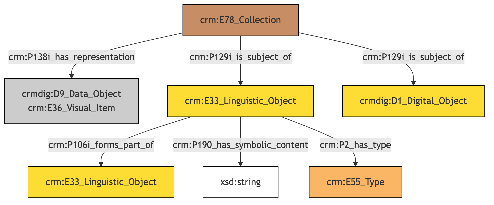

# Archival Unit Reference Data Model

**Author**: George Bruseker, Denitsa Nenova  

**Version**: 1.0

The Archival Unit model is meant to provide a semantic data representation of fields typically used in the documentation of archival records. The generation of archival records typically entails the documentation of a physical and intellectual organization of a collection of holdings. The archival unit model provides a semantic construct for representing these levels in the CIDOC CRM. An instance of Archival Unit is meant to be equivalent to a categorical level of documentation in archival data structures such as fond, series, sub-series etc. It is meant to be used to document collections of items organized physical and intellectualy in a hierarchy from Fond downward. It is agnostic to the number of levels or particular means of determining the distribution of levels. Ths archival unit is not meant to be used to document individual archival items documented in their own right. To document individual archival items in their own right, please use the physical information carrier model. 


## Sources


## Model Sections Description


### Names and Classifications

The attribution of names and types is a basic human activity. A chief factor in disambiguating archival units lies in understanding the various names and identifiers that have been given to them at different moments in their individual histories. Likewise, additional classifiers of the unit, such as how it has been formally classified, give important distinguishing characteristics.

{{ read_csv('docs/et/archivalCSV/archival_names.csv') }}

The model provides means for tracking identifiers, present and past name use, names and well known typological attributions of the archival unit.


??? example "Turtle Encoding"

    ```turtle
    --8<-- "docs/et/archivalCSV/ttl/archival_names.ttl"
    ```


### Description

Archival units are the subjects of innumerable descriptions that provide a wide range of information with regards to their conditions and history. Such an aim drives the need for the tracking of description information as a separate category. The descriptors necessary to this task are documented in the table below.


{{ read_csv('docs/et/archivalCSV/archival_desc.csv') }}


These descriptors should be deployed together in order to provide full context to ‘text blobs’ by means of authorship, type of description as well as the time of articulation.


??? example "Turtle Encoding"

    ```turtle
    --8<-- "docs/et/archivalCSV/ttl/archival_desc.ttl"
    ```


### Parthood

Archival units may require documentation not just as a whole, but with regards to their parts. This information category gathers together the basic descriptors typically deployed to this end. The parthood relations of archival units are both highly important information in understanding of this type of work and also highly complex to document. In this base model, we represent simply the relation of belonging of one archival unit to another. An extended model would take account of mereological and topological relations in a much richer way. At the basic reference level, however, this level of detail is not necessary.


 
{{ read_csv('docs/et/archivalCSV/archival_parthood.csv') }}





??? example "Turtle Encoding"

    ```turtle
    --8<-- "docs/et/archivalCSV/ttl/archival_parthood.ttl"
    ```


### Existence

Of essential importance in identifying and tracking archival units is information pertaining to their existence, particularly regarding their construction and destruction dates. For this reason, we have clustered descriptors relevant to such information in a common ‘existence’ category. These are described in the table below.

 
{{ read_csv('docs/et/archivalCSV/archival_existence.csv') }}


The above structure allows for the documentation of time of creation and destruction of an archival unit as a whole. Note that while ontologically speaking the agency in the events of creation could be documented as part of this information unit, we have instead clustered this data in the actors Relations category.


??? example "Turtle Encoding"

    ```turtle
    --8<-- "docs/et/archivalCSV/ttl/archival_existence.ttl"
    ```


### Actor Relations

The connection between an archival unit and actors provides another important set of descriptors for identifying and tracing it. Particularly, basic interest clusters around the individuals involved in the creation of the archival unit and those who own the archival unit presently. The actor relations information gathers these together.

{{ read_csv('docs/et/archivalCSV/archival_relation.csv') }}

These descriptors allow the connection of an archival unit to its creator and present owner.




??? example "Turtle Encoding"

    ```turtle
    --8<-- "docs/et/archivalCSV/ttl/archival_relation.ttl"
    ```


### Substance

The analysis and understanding of an archival unit depends also on our knowledge of its materiality and physical characteristics. The category of substance brings together descriptors which are relevant to this form of analysis. Particularly, it groups information having to do with the composition and measurable aspects of the archival unit as an object. Information regarding the decomposition of the archival unit into parts is found in the parthood category.


{{ read_csv('docs/et/archivalCSV/archival_substance.csv') }}





??? example "Turtle Encoding"

    ```turtle
    --8<-- "docs/et/archivalCSV/ttl/archival_substance.ttl"
    ```


### Aboutness

This information category provides the means to gather information to the representational level of an archival unit.

{{ read_csv('docs/et/archivalCSV/archival_aboutness.csv') }}





??? example "Turtle Encoding"

    ```turtle
    --8<-- "docs/et/archivalCSV/ttl/archival_aboutness.ttl"
    ```


### Events

This information category brings together typical events in which an archival unit may have been involved through the course of its history. It is meant to cover information concerning the most salient events documented with regards to archival units. At present this enables the documentation of functional use periods, ownership periods and conservation events. 

{{ read_csv('docs/et/archivalCSV/archival_events.csv') }}


??? example "Turtle Encoding"

    ```turtle
    --8<-- "docs/et/archivalCSV/ttl/archival_events.ttl"
    ```


### Location

The documentation of location aids in tracking the present location of individual archival units as well their dispersion geographically. This information category gathers together relevant descriptors for this task.

{{ read_csv('docs/et/archivalCSV/archival_location.csv') }}





??? example "Turtle Encoding"

    ```turtle
    --8<-- "docs/et/archivalCSV/ttl/archival_location.ttl"
    ```


### Rights

This category brings together descriptors that aid in the documentation of right holders and rights relative to an archival unit.

{{ read_csv('docs/et/archivalCSV/archival_rights.csv') }}





??? example "Turtle Encoding"

    ```turtle
    --8<-- "docs/et/archivalCSV/ttl/archival_rights.ttl"
    ```


### Documentation

This information category unites referential information about the documented archival unit, providing contextual data about it.

{{ read_csv('docs/et/archivalCSV/archival_docs.csv') }}





??? example "Turtle Encoding"

    ```turtle
    --8<-- "docs/et/archivalCSV/ttl/archival_docs.ttl"
    ```
