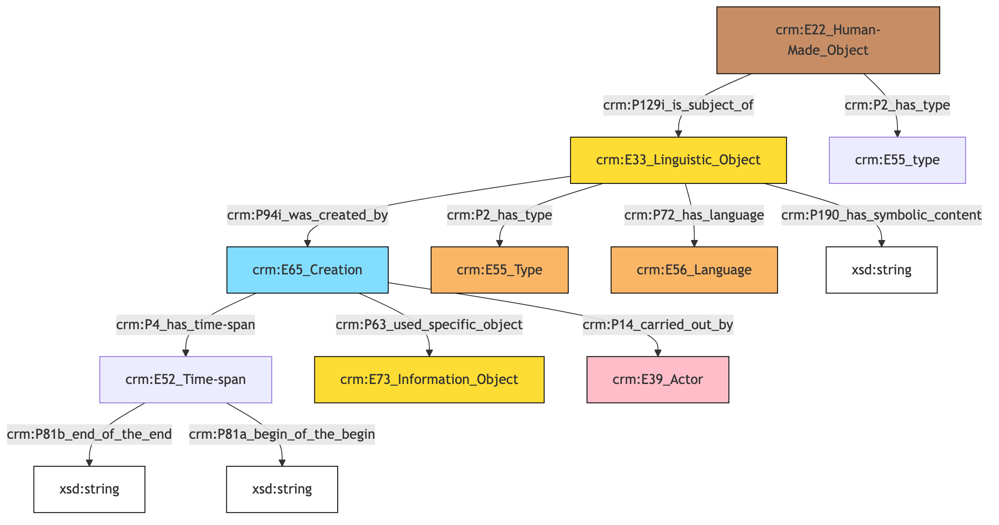
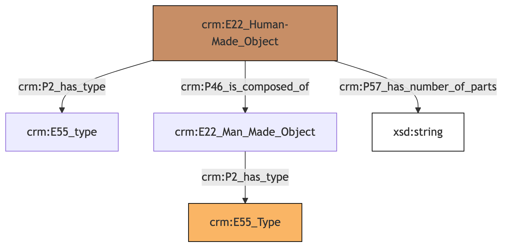
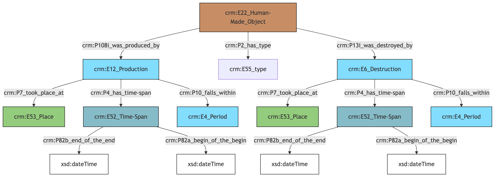
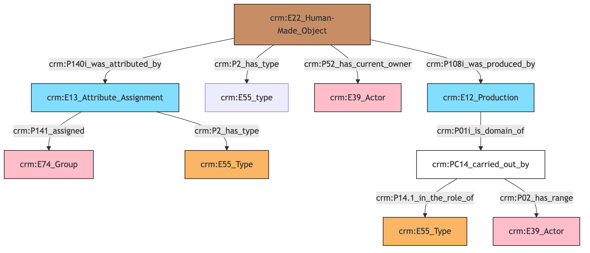
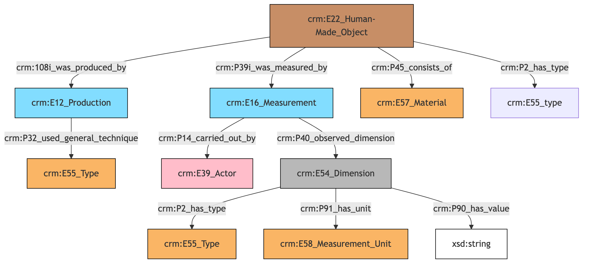
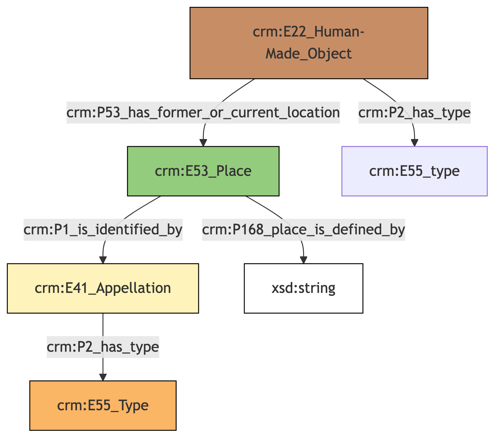
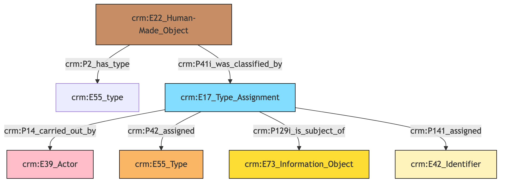
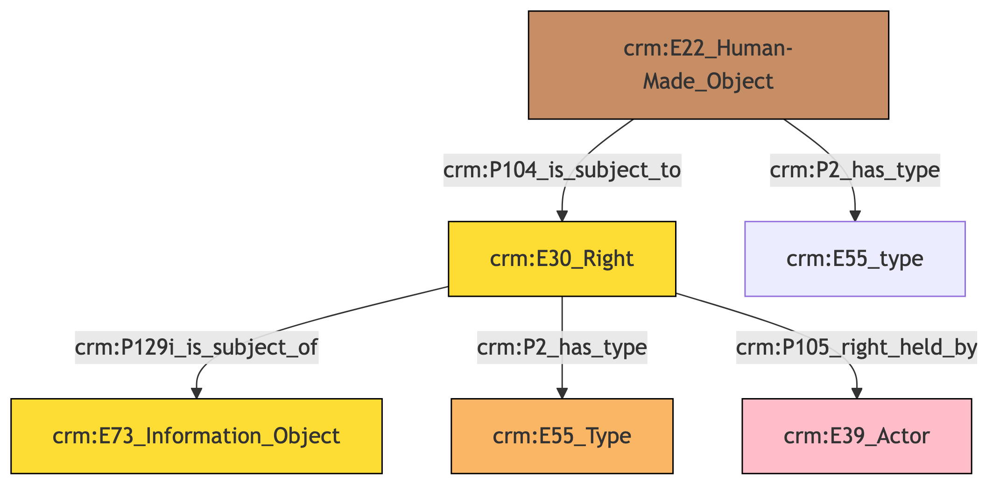

# Physical Information Carrier Reference Data Model

**Author**: George Bruseker, Denitsa Nenova  

**Version**: 1.0

The physical information carrier model is meant to support the semantic representation of physical objects of documentary interest which are in the care of memory institutions. Such objects, documented on the item level, are typically the physical supports of important documentary evidence in visual, textual or other form, and provide a historical trace or connection to past events as being the unique, individual physical documents created in the life of an individual or institution. Examples of a physical information carrier would include a physical plan, letter or photographic print. The physical information carrier model provides typical fields used for cataloguing information regarding these objects in themselves. The physical information carrier can then be linked to further semantic information records such as the archive unit model for documenting the structural records of an archival recording process or the image model for documenting the intellectual content of a visual image represented on a photographic print.


## Model Sections Description


### Names and Classifications


The attribution of names and types is a basic human activity. A chief factor in disambiguating physical information carriers lies in understanding the various names and identifiers that have been given to them at different moments in their individual histories. Likewise, additional classifiers of the image, such as how it has been formally classified, give important distinguishing characteristics.


{{ read_csv('docs/et/carrierCSV/carrier_name.csv') }}

The model provides means for tracking identifiers, present and past name use, names and well known typological attributions of the physical information carrier.


??? example "Turtle Encoding"

    ```turtle
    --8<-- "docs/et/carrierCSV/ttl/carrier_name.ttl"
    ```


### Description


{{ read_csv('docs/et/builtWorkCSV/Built_Work_description.csv') }}


These descriptors should be deployed together in order to provide full context to ‘text blobs’ by means of authorship, type of description as well as the time of articulation.





??? example "Turtle Encoding"

    ```turtle
    --8<-- "docs/et/builtWorkCSV/ttl/Built_Work_description.ttl"
    ```


### Parthood

physical information carriers may require documentation not just as a whole, but with regards to their parts. This information category gathers together the basic descriptors typically deployed to this end. The parthood relations of physical information carriers are both highly important information in understanding of this type of work and also highly complex to document. In this base model, we represent simply the relation of belonging of one physical information carrier to another. An extended model would take account of mereological and topological relations in a much richer way. At the basic reference level, however, this level of detail is not necessary.


 
{{ read_csv('docs/et/builtWorkCSV/Built_Work_parthood.csv') }}





??? example "Turtle Encoding"

    ```turtle
    --8<-- "docs/et/builtWorkCSV/ttl/Built_Work_parthood.ttl"
    ```


### Existence

Of essential importance in identifying and tracking physical information carriers is information pertaining to their existence, particularly regarding their construction and destruction dates. For this reason, we have clustered descriptors relevant to such information in a common ‘existence’ category. These are described in the table below.

 
{{ read_csv('docs/et/builtWorkCSV/Built_Work_existence.csv') }}


The above structure allows for the documentation of time of construction and destruction of a physical information carrier as a whole. Note that while ontologically speaking the agency of the architect and builder in the events of construction could be documented as part of this information unit, we have instead clustered this data in the actors Relations category.




??? example "Turtle Encoding"

    ```turtle
    --8<-- "docs/et/builtWorkCSV/ttl/Built_Work_existence.ttl"
    ```

### Actor Relations

The connection between a physical information carrier and actors provides another important set of descriptors for identifying and tracing it. Particularly, basic interest clusters around the individuals involved in the creation of the physical information carrier and those who own the physical information carrier presently. The actor relations information gathers these together.

{{ read_csv('docs/et/builtWorkCSV/Built_Work_actor_relations.csv') }}

These descriptors allow the connection of a physical information carrier to its creator and present owner.




??? example "Turtle Encoding"

    ```turtle
    --8<-- "docs/et/builtWorkCSV/ttl/Built_Work_actor_relations.ttl"
    ```


### Substance

The analysis and understanding of a physical information carrier depends also on our knowledge of its materiality and physical characteristics. The category of substance brings together descriptors which are relevant to this form of analysis. Particularly, it groups information having to do with the composition and measurable aspects of the physical information carrier as an object. Information regarding the decomposition of the physical information carrier into parts is found in the parthood category.


{{ read_csv('docs/et/builtWorkCSV/Built_Work_substance.csv') }}




??? example "Turtle Encoding"

    ```turtle
    --8<-- "docs/et/builtWorkCSV/ttl/Built_Work_substance.ttl"
    ```


### Aboutness

This information category provides the means to gather information to the representational level of a physical information carrier.


{{ read_csv('docs/et/builtWorkCSV/Built_Work_aboutness.csv') }}


??? example "Turtle Encoding"

    ```turtle
    --8<-- "docs/et/builtWorkCSV/ttl/Built_Work_aboutness.ttl"
    ```


### Events

This information category brings together typical events in which a physical information carrier may have been involved through the course of its history. It is meant to cover information concerning the most salient events documented with regards to physical information carriers. At present this enables the documentation of functional use periods, ownership periods and conservation events. 

{{ read_csv('docs/et/builtWorkCSV/Built_Work_events.csv') }}


??? example "Turtle Encoding"

    ```turtle
    --8<-- "docs/et/builtWorkCSV/ttl/Built_Work_events.ttl"
    ```


### Location

The documentation of location aids in tracking the present location of individual physical information carriers as well their dispersion geographically. This information category gathers together relevant descriptors for this task.

{{ read_csv('docs/et/builtWorkCSV/Built_Work_location.csv') }}




??? example "Turtle Encoding"

    ```turtle
    --8<-- "docs/et/builtWorkCSV/ttl/Built_Work_location.ttl"
    ```


### Designation Status

Characteristic of information gathered relative to physical information carriers are various kinds of official designations types that are given to these objects by various agencies. Assignment of such designations is related to various protocols in the assigning institutions and are often accompanied by regulations on the kind of activity that can be undertaken relative to the physical information carrier in question. Such designations also provide means of identifying a physical information carrier across records. This information category gathers together descriptors relative to this information.

{{ read_csv('docs/et/builtWorkCSV/Built_Work_designation_status.csv') }}




??? example "Turtle Encoding"

    ```turtle
    --8<-- "docs/et/builtWorkCSV/ttl/Built_Work_designation_status.ttl"
    ```

### Rights

This category brings together descriptors that aid in the documentation of right holders and rights relative to a physical information carrier.

{{ read_csv('docs/et/builtWorkCSV/Built_Work_rights.csv') }}




??? example "Turtle Encoding"

    ```turtle
    --8<-- "docs/et/builtWorkCSV/ttl/Built_Work_rights.ttl"
    ```


### Documentation

This information category unites referential information about the documented physical information carrier, providing contextual data about it.

{{ read_csv('docs/et/builtWorkCSV/Built_Work_documentation.csv') }}


??? example "Turtle Encoding"

    ```turtle
    --8<-- "docs/et/builtWorkCSV/ttl/Built_Work_documentation.ttl"
    ```


