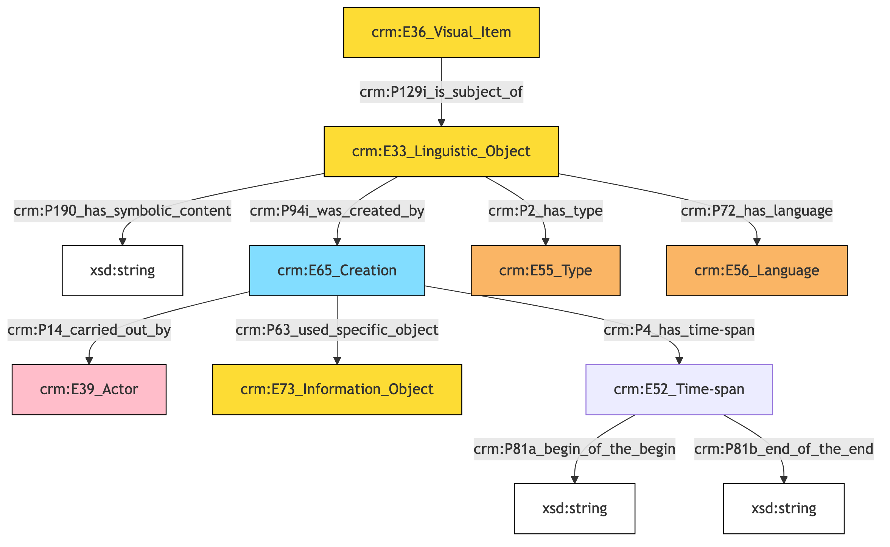
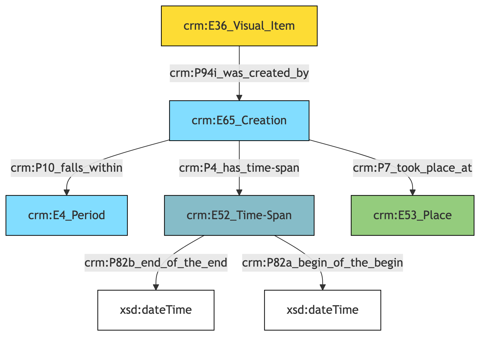

# Image Reference Data Model

**Author**: George Bruseker, Denitsa Nenova  

**Version**: 1.0

The Image model is meant to support the semantic representation of photographic and other visual media data. Visual media have the particular characteristic of seriality. The generation of an image is the creation of an intellectual content which thereafter can have multiple manifestations across different potential carriers both analogue and digital. As such the documentation of visual media requires semantic modelling which supports the documentation of both the individual carriers (photographic prints, photographic negatives, slides, catalogued photo material, born digital images etc.) and the image itself as the consistent object carried in various ways across these different media. The image model is meant to support the documentation of the latter. Similar to the concept of ‘work’ in FRBR and FRBRoo, the image is primary intellectual object created and then manifested in different media over time. The image model enables the representation of this intellectual content as such and linking it, in turn, to its potential carriers: physical information carriers and digital resources.


## Sources


## Model Sections Description


### Names and Classifications

The attribution of names and types to an image, as with other entities, is a basic human activity. A chief factor in disambiguating images lies in understanding the various names and identifiers that have been given to them at different moments in their individual histories. Likewise, additional classifiers of the image, such as how it has been formally classified, give important distinguishing characteristics.

{{ read_csv('docs/et/imgCSV/img_name.csv') }}

The model provides means for tracking identifiers, present and past name use, names and well known typological attributions of the image.


??? example "Turtle Encoding"

    ```turtle
    --8<-- "docs/et/imgCSV/ttl/img_name.ttl"
    ```


### Description

Images are the subjects of innumerable descriptions that provide a wide range of information with regards to the aesthetic and historical importance of the work, *inter alia*. Such descriptions are of use in a scholarly understanding of an image only if we are able to track the provenance of such elocutions in a systematic fashion. Such an aim drives the need for the tracking of description information as a separate category. The descriptors necessary to this task are documented in the table below.

{{ read_csv('docs/et/imgCSV/img_desc.csv') }}


These descriptors should be deployed together in order to provide full context to ‘text blobs’ by means of authorship, type of description as well as the time of articulation.





??? example "Turtle Encoding"

    ```turtle
    --8<-- "docs/et/imgCSV/ttl/img_desc.ttl"
    ```


### Existence

Of essential importance in identifying and tracking images is information pertaining to their existence, particularly regarding their construction and destruction dates. For this reason, we have clustered descriptors relevant to such information in a common ‘existence’ category. These are described in the table below.

 
{{ read_csv('docs/et/imgCSV/img_existence.csv') }}





??? example "Turtle Encoding"

    ```turtle
    --8<-- "docs/et/imgCSV/ttl/img_existence.ttl"
    ```


### Aboutness

This information category provides the means to gather information to the representational level of an image.


{{ read_csv('docs/et/imgCSV/img_about.csv') }}


??? example "Turtle Encoding"

    ```turtle
    --8<-- "docs/et/imgCSV/ttl/img_about.ttl"
    ```


### Rights

This category brings together descriptors that aid in the documentation of right holders and rights relative to an image.

{{ read_csv('docs/et/builtWorkCSV/img_rights.csv') }}


??? example "Turtle Encoding"

    ```turtle
    --8<-- "docs/et/builtWorkCSV/ttl/img_rights.ttl"
    ```


### Item Information

The documentation of images allows the optional tracking of individual images held by institutions and where they are held, in order to aid scholars in retrieving copies of it.

{{ read_csv('docs/et/builtWorkCSV/img_item.csv') }}


??? example "Turtle Encoding"

    ```turtle
    --8<-- "docs/et/builtWorkCSV/ttl/img_item.ttl"
    ```


