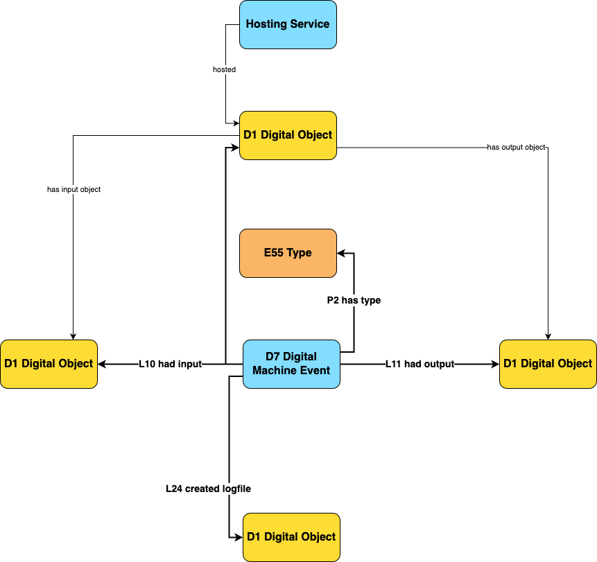
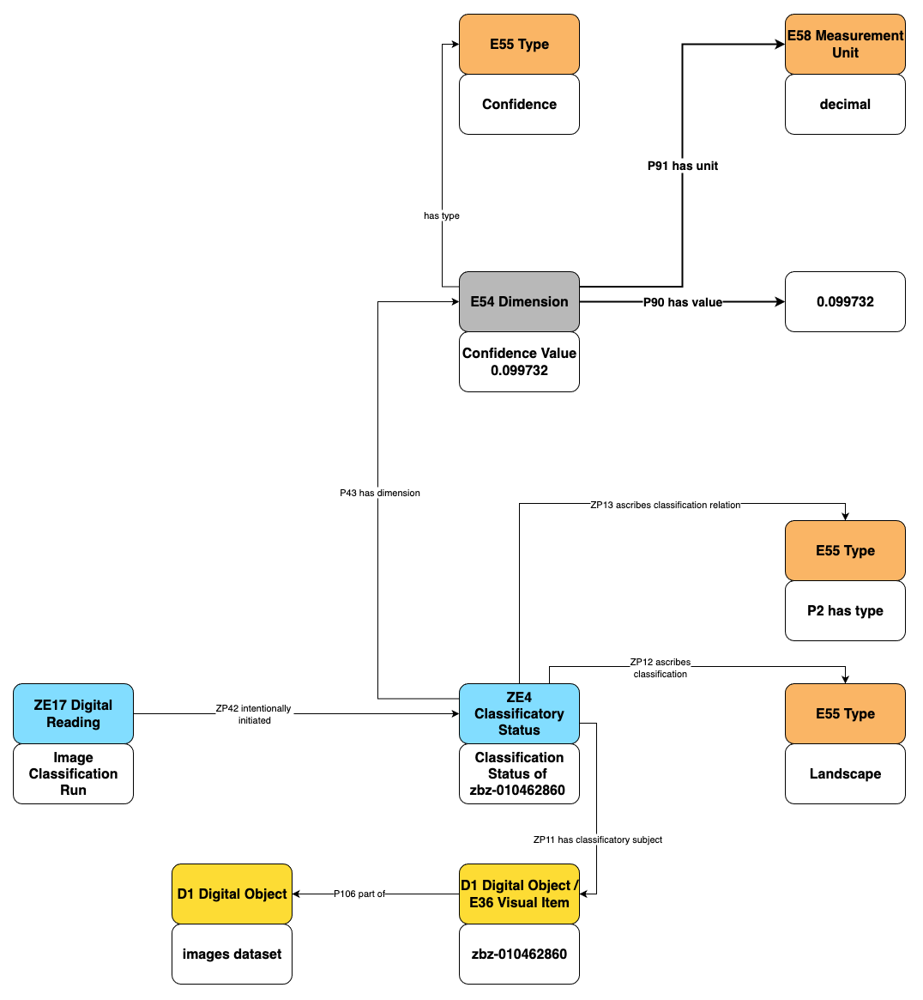
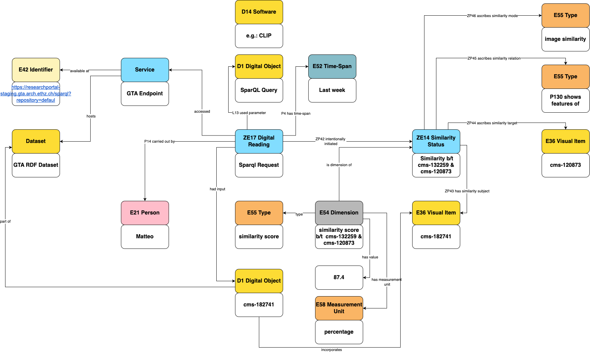
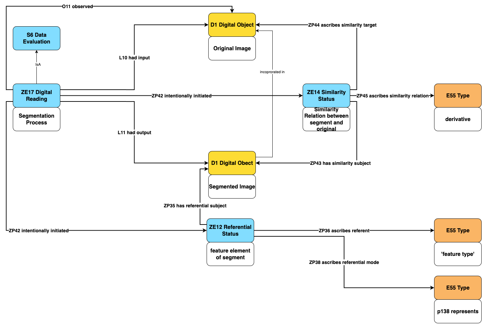
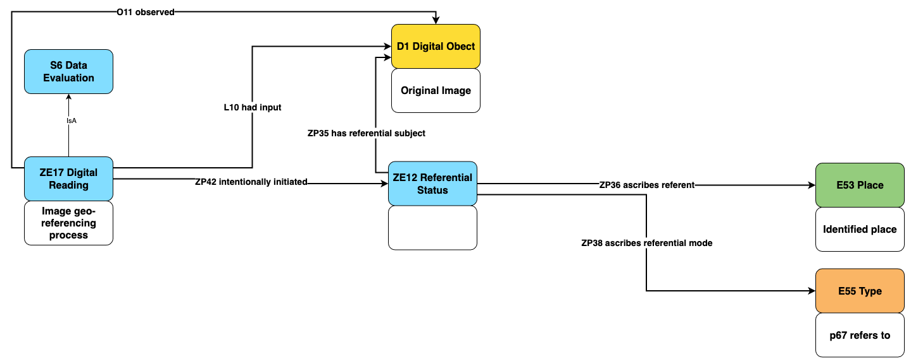
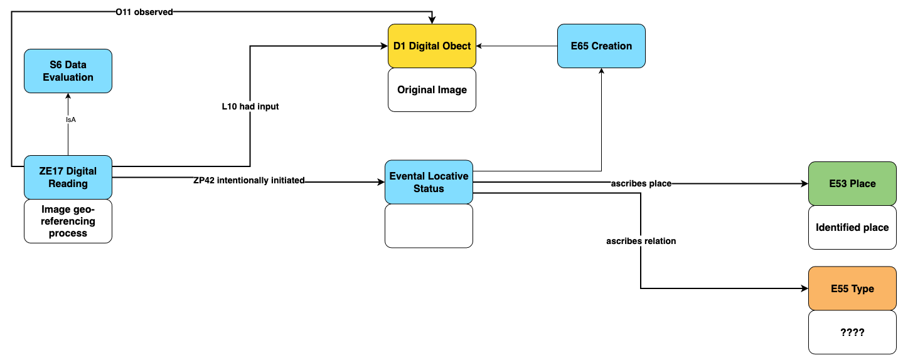
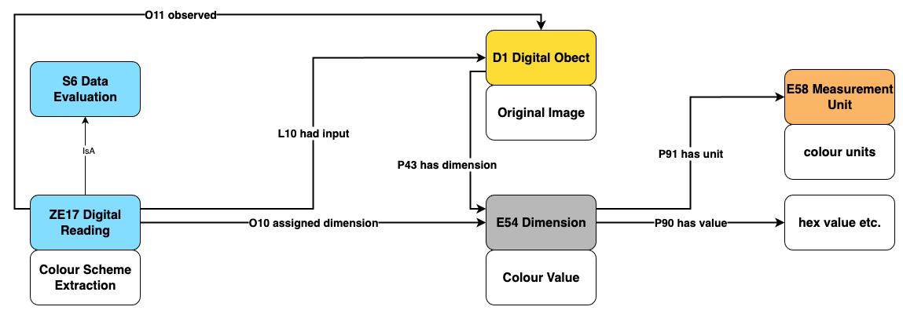

### 3.1 Definition & Focus

In an analog context, *provenance* is the record of ownership, custody or location of an object (e.g., a work of art, an archaeological object, etc.). Similarly, with respect to digital objects, *digital provenance* captures the creation, modification and derivation of digital assets. Digital provenance plays a documentation role as it enables users/consumers of digital objects (e.g. data) to understand the chronology of modifications and usages that a given object underwent during and after its creation. Provenance documentation can be produced for any kind of digital objects: texts, images, videos and audio recordings, as well as for  annotations made on any of these objects. The term *annotation* is used to refer to statements about digital objects created by human agents, as well as by machine agents (e.g. algorithms, processing pipelines, etc.). 

This report focusses on digital provenance as a way of unpacking and documenting the chain of processing steps that constitute data processing pipelines, thus including CV pipelines. As the annotations produced as output by a pipeline step become the input of successive step, documenting the provenance of the final annotations (e.g. enrichment) produced by a pipeline entails documenting the intermediate processing steps.

### 3.2 The process of annotating

The goal of this brief section is to provide a precise natural language description of the entities that are at play in the process of annotating digital objects (both texts and images), in the view of defining a semantic model. Key terms/concepts – which should then be modelled semantically – are highlighted in *italic*. 

- **Data, dataset, corpus.** The set of *digital objects* that we run through a CV tool or model for processing (e.g., transformation, enrichment, etc.). These digital objects may be textual documents, visual items (images), or even metadata. They may be organised in the form of a *dataset* (or corpus), described by its own set of metadata. 
- **Annotation.** Annotation is the process of enriching an existing *digital object* with additional information.
	- The *author* of an annotation can be 1) a human – such is the case with ground-truth annotations used to train a model, or with crowd-sourced annotations or 2) a "machine" (proxy term for the tool or model used to produce the annotation) – in this case we use *annotation* to refer to a digital representation that expresses the *prediction* made by the model.
	- The *target* of the annotation (i.e. what the annotation applies to) may be a) the entire object (e.g. for image/text classification), b) a specified portion of an object (e.g. object detection or named entity recognition), or c) pairs of objects[^14] (e.g. image or text similarity).  
	- In the context of machine-generated annotations, each prediction may have a *confidence score* attached,  which represents the model's confidence in making that prediction (usually a value between `0` and `1`). Confidence score – when reliable – are useful to   
- **Models, tools, libraries.** We talk about *models* in the sense of machine learning models (e.g., a YOLO v. 5 object detection model). Programming libraries in various languages are employed to *implement* ML models (e.g. TensorFlow) or to make them more easily shareable, accessible and usable (e.g. the Python HuggingFace library, with its hub where models are shared). A *tool* may use several software *libraries* and may rely on multiple *models* to do what it does. 
- **Pipeline.**  It is a way of defining a processing chain made of several sequential *steps*, and where the *output* of a step becomes the *input* of the following step. The pipeline as a whole has an overall  input and an overall output. Typically, each pipeline step corresponds to calling one tool or model on some input data, and using the output as an input to the following tool or model.  

### 3.3 Previous approaches to digital provenance

#### W3C Provenance ontology (Prov-O)
Prov-O[^10] is a simple and domain-agnostic ontology to represent provenance, developed by the W3C Provenance Incubator Group. It  models provenance as the interplay of three core classes: entities (`prov:Entity`), agents (`prov:Agent`) and activities (`prov:Activity`). *Entities* are the *things* of which we want to describe provenance; *activities* are the events that lead to the creation, modification, use of these *entities*; and *agents* are entities that participate to the *activities* events and are responsible for actions affecting entities. The high level of genericity of this ontology has led to numerous extensions of this ontology be developed to fit a wide variety of domains and use cases.[^9] 

#### Prov-O and the Open Citations Data Model (OCDM)
An interesting application of Prov-O is the one it found in the context of the Open Citations Data Model (OCDM) [REF], which specifies the semantic representation of Open Citations data. Prov-O is used in OCDM to track how a given resource (`prov:Entity`) changes between any two specific points in time (called *snapshots*). OCDM extends Prov-O by providing the ability to specify exactly how an entity has changed; this is obtained by introducing a property called `hasUpdateQuery` which contains the operations (insertions and deletions) that occurred to a given entity between two snapshots. This solution allows the maintainers of OC datasets to revert to the "state of affairs" of any resource at the time of a given snapshot.  

#### Provenance and the Web Annotation Data Model (WADM)
[@cornut_annotations_2023] provide an example of how to model the provenance of both human- and machine-generated annotations on images by using a combination of the Web Annotation Data Model (WADM)[^11] and the Image Interoperability Framework (IIIF) standard. Their approach to machine-generated annotations is particularly of interest for the present report. In their paper they describe how the predictions of an object detection model (`vitrivr`) can be represented by using WADM's classes and properties. In Listing 1 at p. 16 they provide an example encoding of a model prediction that detected an object of type "person" within an image. The annotation's target (`wadm:target`) corresponds to the part of the image concerned by the annotation and point's to the image manifest as well as to the box coordinates via the `source` and `selector` properties respectively. This annotation has three bodies (`wadm:body`) attached to it: one with `purpose=tagging` to identify the annotation's author (i.e. the `vitrivr` software in this cases), one with `purpose=commenting` to encode the model's detection score (represented as a string), and one with `purpose=commenting` to represent the tag `person` assigned by the model to the image portion. 

#### CRMdig extension
CRMdig is an extension of the CIDOC-CRM ontology aimed at providing a generic framework for representing provenance, as well as a specialisation for representing the provenance of digital objects across a wide variety of domains. At a high-level, CRMdig displays substantial similarities with Prov-O as they are both event-based ontologies; the naming differs slightly as Prov-O talks about entities, agents (with roles) and activities, while CRMdig describes provenances in terms of entities, actors (with roles) and events. Classes/properties of CRMdig that are relevant for describing machine-generated annotations are: `D1 Digital Object`, `D10 Software execution` (event), `D9 Data Object`, `D14 Software`, `D35 Area`.

#### Other approaches
It is worth mentioning other approaches we are aware of concerning the modelling of predictions made by CV models:
- *Modelling of image similarity*. In [@klic_linked_2023] the similarity between pairs of images is modelled by using the Similarity Ontology[^13]: the tool used to measure the similarity becomes the employed method (`sim:AssociationMethod`), whose `sim:weight` is the numerical value that expresses the similarity between two images. This pattern allows for expressing the fact that the similarity of an image pair can be measure by different tools thus leading to different similarity scores.  
- *Modelling of colour-scheme extraction*. In the BSO knowledge graph, the extraction of colour-scheme from images is modelled as follows: the Python code (Jupyter notebook) that contains the programming logic for computing the colour-scheme of an image is modelled as a *specific technique* (`crm:E29 Design or Procedure`) used by an attribute assignment activity (`crm:E13 Attribute Assignment`), whose time-span corresponds to the execution time/date of the Jupyter notebook. 
- *Modelling of geo-referencing of images*. In the BSO knowledge graph, images (of paintings) are enriched with geo-referencing information created by using the Smapshot tool. The process of geo-referencing is modelled as an instance of  `crmsci:S7 Simulation or Prediction` from the Scientific Observation Model (CRMsci)[^12], which in turn is a specialisation of `crm:E13 Attribute Assignment`. Geo-referencing an image is represented as the observation (performed by using a tool) of a given site, which occupies a geographical place represented in a given painting (`E36 Visual Item`).   

### 3.4 Towards a unified approach

#### 3.4.1 Discussion of previous approaches

The approach to model digital provenance adopted by OCDM seems more viable in cases where we want to track, at a fine-grained level, the evolution of resources/documents over time (creation, modification, merge), but it seems less viable as an approach in the case of (machine-)annotations, as they tend to be highly volatile (i.e. they are replaced by those produced by a new model's run).

Prov-O is highly generic, thus it needs to be specialised in order be useful. At the same time, it is very similar to CRMdig (as both are event-based), which may be an argument in favour of adopting CRMdig, which has the advantage of being already integrated into the CIDOC-CRM ecosystem. The semantic encoding of machine-generated annotations put forward by the BSO project at SARI demonstrates the feasibility of employing classes and properties from CIDOC-CRM to this end. However, this approach will need to be generalised so that it can be applied to a broader variety of use cases, including e.g. representing the results of computing similarity between pairs of images [@klic_linked_2023]. 

When working with visual contents the WADM approach has the big advantage that it integrates seamlessly with IIIF as a way to express the target of annotations (be it the entire image or just a portion). This may be in itself a reason for choosing this approach especially in cases where it is planned to render in a user-facing applications the annotations on images generated by a tool or model. At the same time, this approach seems to sacrifice the precision of semantic descriptions. A good example of this loss of semantic precision is the fact the model's confidence score is represented as a string in the example above; it's a rendering-oriented solution that may work less well when e.g. we want to filter annotations by confidence score.

#### 3.4.2 Ontological foundations and methodology

The unified approach to documenting digital provenance we propose has, as its ontological foundations, the following ontologies: CIDOC CRM, CRMdig for what concerns the representation of software, data, and more generally digital processing events; and, finally, AAAo for modelling digital reading, namely the usage of computational processes to process and further enrich visual and textual data. 

We employed the Semantic Reference Data Models (SRDM) methodology [REF], which facilitates the development of user-friendly and maintainable semantic data modelling documentation.  In summary, SRDM documentation comprises *models*, which are distinct real-world entities documented, and *fields*, which are unique and identifiable data points, each assigned a name, identifier, human-readable description, and a defined semantic path within an ontology.  Groups of linked fields can be further arranged into *collections*, while *projects* serve to aggregate related models, collections, and fields.

To develop the semantic modelling of digital provenance, we initially examined several real-world use cases (descriptions provided below); this analysis enabled us to identify the relevant classes and properties involved in digital provenance, which were subsequently documented as SRDM models and fields, and ultimately mapped onto ontological patterns. These modelling patterns are described via the Zellij documentation tool [REF], produced by Takin Solutions.

#### 3.4.3 Modelling use cases

As use cases for the modelling of digital provenance, we considered a broad set of data processing pipelines. While some of them are quite generic and can be applied to several media types (classification and similarity), others are more specific to the domain of computer vision. These use cases do not aim at an exhaustive coverage of all possible cases, but they rather aim to cover a broad variety of situations that one is faced with when documenting the provenance of machine-generated annotations.  

##### Image classification

*Classification* is the task of assigning a textual label (representing a class) to an input digital object (e.g., text, image, etc.), based on a pre-defined taxonomy. Class labels can be purely textual (strings) or concepts from other existing graphs (SKOS taxonomy, Wikidata, etc.). 

As an example of image classification, we considered the pipeline developed by SARI for the BSO project [^15]. This pipeline aims at classifying images as being landscape paintings or not; thus the model can assign either the label `landscape` or the one `not landscape`. The pipeline is implemented as a set of Jupyter notebooks and consists of four steps:

1. manual image annotation;
2. model training based on annotated images;
3. image classification (prediction);
4. serialization of the output as an RDF graph. 

##### Image similarity detection

*Image similarity detection* is the task of computing a numerical score that captures the visual similarity between two images. The spectrum of similarity is wide-ranging, encompassing anything from the visual relatedness of an image pair to the fact that one image is a duplicate (or copy) of another.

As an example of image similarity detection, we considered the similarity search API developed by SARI for the gta project[^17], available at the address [https://researchportal-staging.gta.arch.ethz.ch/sparql](https://researchportal-staging.gta.arch.ethz.ch/sparql). This API accepts SPARQL queries and returns a list of images that are similar to the input one; for each pair of similar images, a similarity score (expressed as a percentage) captures the degree of similarity between the two images. Here is an example of query to retrieve gta images that are similar to [`cms-182741`](https://iiif.gta.arch.ethz.ch/iiif/2/cms-182741/full/300,/0/default.jpg):

```sparql
PREFIX clip: <https://service.swissartresearch.net/clip/>
PREFIX rdf: <http://www.w3.org/1999/02/22-rdf-syntax-ns#>
SELECT ?subject ((ROUND(?scoreFull * 1000 )) / 10  AS ?score) WHERE {
  SERVICE <http://clip-service:5000/sparql> {
    ?request rdf:type clip:Request;
      clip:queryURL <https://iiif.gta.arch.ethz.ch/iiif/2/cms-182741/full/300,/0/default.jpg>;
      clip:minScore 0.2;
      clip:score ?scoreFull;
      clip:iiifUrl ?subject.
  }
}
LIMIT 2

```

Behind the scenes, the API uses a CLIP (Contrastive Language-Image Pretraining) model[^16] to compute image similarity. 

##### Image segmentation

*Image segmentation* is the task of segmenting an input image into areas of interest (typically polygons), and it is typically used to locate objects and object boundaries within images. Object detection and also layout recognition are all forms of image segmentation. 

As an example of image segmentation, we consider the pipeline developed by SARI for the BSO project[^18]. As images issuing of a digitisation process often contain the digitised item (a photo, a notebook, a painting, etc.) together with a color checker, the pipeline performs segmentation in order to identify only the relevant portions of the image. Typically, for further display and processing of images (e.g. image similarity), we want to exclude the image portion containing the color checker and keep only the one that contains the actual item of interest.

The pipeline is implemented as a set of Jupyter notebooks and consists of the following steps:

1. image download;
2. manual image annotation;
3. model training based on annotated images;
4. image segmentation
5. serialization of the output as an RDF graph. 


##### Image geo-referencing

Georeferencing is the process of assigning x, y coordinates to a raster file, such as an image, an aerial photograph, scanned historical map, etc. so GIS software can place the resulting georeferenced file in its specified location on a map. As an example of this task, we consider a pipeline developed for the BSO project, which aims at identifying and geo-locating the standpoint of the artist in creating a landscape painting (i.e. the artist's point of observation). This pipeline relies on the above described image classification pipeline to filter only landscape paintings, as georefencing is not applicable to e.g. a portrait painting. It then relies on the manual georeferencing of images, which is crowdsourced through `smapshot`[^20], a tool for georeferencing historical images.

##### Colour scheme extraction

*Colour scheme extraction* is the process of automatically identifying and grouping dominant colours within an image. As an example of this task, we consider a pipeline developed for the BSO project, which extracts RGB colours of each image by using the library [`extcolors`](https://pypi.org/project/extcolors/).[^19] It is worth noting that, Uunlike the previously described use cases, this pipeline does not perform machine learning-based classification, but rather extracts colour attributes that are already present in the image.  

#### 3.4.4 Modelling recipes

##### Modelling of a digital reading pipeline

What is common to all five use cases outlined above: each processing pipeline is a **digital workflow** which can be represented as  a sequence of steps, having dependencies between one another, where each step typically has an input, produces an output, and is performed by means of some purpose-fit software (code/tool/API). 

Pipeline steps can be of two types: 
 - *digital machine events* (`crmdig:D7 Digital Machine Event`) such as downloading data, transforming data, training a ML model, etc.; these are typically digital processes that produce new or derivative data but that do not create aby propisitions about the input data.
 - and *digital reading events* (`aaao:ZE17 Digital Reading`) which are digital processing events that lead to the creation of new propositions about the content of an input data. 

The concept of *digital reading* is borrowed from the AAAo ontology, where it is defined as follows:

> An instance of digital reading is a digital processing event guided by a set of instructions or parameters for returning an output result set of identifications that makes propositions about the content of an input dataset. Digital reading is a computational process guided by a parametrized hypothesis resulting in a new propositional dataset for scientific consideration.[^21]

While the modelling of digital reading pipelines tends to be quite generic (i.e., all pipeline steps tend to have a substantial number of common properties), the modelling of the semantics of the predictions (i.e., the propositional statements made) by a given pipeline depends on the specific task at hand. 

The diagram below shows the semantic modelling of key aspects of a generic pipeline step. An important aspect that is not represented in this diagram is that steps forming a more complex pipeline can be "linked" with one another via the property `P20_had_specific_purpose`. 


/// caption
Modelling of a digital reading pipeline step 
///
<!-- Image source: Tab `General Digital Workflow` -->

##### Modelling of image classification

In this section we focus specifically on the semantic modelling of the prediction step of the BSO image classification pipeline described [above](#image-classification). The ML model that was trained for this task on BSO training data assigns to any new input image given as output the label `landscape` or `not landscape`. Taking as an example the image with identifier `zbz-010462860`, the model assigned to it the class `landscape` with a confidence score of `0.099732`.

We treat this classification as a new propositional object generated by the model: the classification itself is modelled as a temporal entity, an institutional fact (`ZE14 Classificatory Status`), that ascribes a class label (`E55 Type`) to a given image. The point in time at which this fact starts to exist corresponds to the moment when the model predicts the class label.    

<!--
- reification of the `has type` property; reified into a proposition that can be the object of further statements, and whose provenace can be precisely traced back to the chain of digital processes that generated it.
- what triggers this new institutional fact? (the prediction step of the pipeline)
- explain how the confidence is modelled (E54 Dimension)
-->


/// caption
Modelling of the BSO image classification use case
///
<!-- Image source: Tab `Classification Step version 1` -->

##### Modelling of image similarity detection

For modelling the semantics of image similarity detection, we refer to the use case described [above](#image-similarity-detection), namely the SPARQL-based API for image similarity search developed for the *gta* project. 

In this scenario, the machine learning predictions are not produced by running a bulk process on an entire dataset, but they are rather returned by a live API that can be queried by users. This important difference is represented in the diagram below (top-left corner): the SPARQL request is represented as a `ZE17 Digital Reading` activity which makes use of the gta SPARQL endpoint in order to produce a series of propositional statements (`ZE14 Similarity Status`) about the visual similarity between pairs of images (`E36 Visual Item`). 

Zooming in into how image similarity is modelled, two aspects are worth noting. As similarity is typically stated about *pairs* of objects (images, texts, etc.), each image pair is represented as the subject and the target of a similarity relation (`ZE14 Similarity Status`) – which is in turn the semantic content of the similarity model's predictions. The property `ZP45 acribes similarity relation` can be used to further qualify the nature of existing similarity (e.g. similarity in the colours, similarity in the gesture or posture of portrayed people, etc.). 


/// caption
Modelling of image similarity detection 
///
<!-- Image source: https://app.diagrams.net/#G15cGd82BeaOiToVGrIG5AcnHjNMaLEgBT#%7B%22pageId%22%3A%22g5mR7cSpMyBNkxGoOB5w%22%7D -->

Finally, the similarity score computed by the model is attached to the similarity relation via the `is dimension of` property, and it uses a pattern based on `E54 Dimension` and `E58 Measurement Unit` to represent such a score – similar to how the model's confidence score was represented in the example above.

##### Modelling of image segmentation

For modelling the semantics of image segmentation, we refer to the use case described [above](#image-segmentation), namely the pipeline developed for the BSO project that identifies the main area of an image as well as the colour-checked from digitisation (if present).

The segmentation process (`ZE17 Digital Reading`), which is part of a longer pipeline (not captured in the diagram below), has as input the image to be segmented and as output the segments that were identified in the original image (if any). 


/// caption
Modelling of the BSO image segmentation use case 
///

The upper part of the diagram describes the (implicit) relation between the original image and its segments (`ZE14 Similarity status`): the segments are derivative images issued by the segmentation process itself. This construct is helpful to track the provenance of these image segments, which may (or not) be serialised and stored as individual images. It can also help in the documentation of cases where the outputs of several segmentation tools and algorithms co-exist side-by-side.

Moreover, the lower part of the diagram deals with the semantics of the segmentation. The referential status (`ZE12 Referential status`) created by the segmentation process allows for attaching vocabulary from a pre-existing taxonomy to the image segments (e.g., "colour checker"). The property `ZP38 ascribes referential mode` is suitable for characterising more precisely the referential function of the segment" it may *refer to* somethinf, *represent* something, *depict* something, etc. 


##### Modelling of image geo-referencing

For modelling the semantics of image geo-referencing, ased on the use case above, we offer two possible modelling recipes, with a decreasing level of genericity. 

The first recipe utilises the referential status (`ZE12 Referential`) as in the image segmentation modelling in order to state a propositional object that relates together an input image with its hypothesised place of creation (via the property `ZP36 ascribes referent`). 


/// caption
Modelling of the BSO image geo-referencing (generic)
///

The second recipe, instead, uses a more semantically precise construct, which builds upon the event locative status (`ZE60 Event locative status`). Such a status represents "a socially recognized connection between an event and a location regardless the real spatiotemporal history of that event, known or unkown" [^22]. In our specific case, the event is the creation of a given painting, which we hypothesise has taken place by the standpoint identified with a given geographical place. 


/// caption
Modelling of the BSO image geo-referencing (place of creation)
///

##### Modelling of colour scheme analysis

🚧 To be added 🔜


/// caption
Modelling of the BSO colour scheme analysis 
///


[^8]: [https://lov.linkeddata.es/dataset/lov/vocabs/sim](https://lov.linkeddata.es/dataset/lov/vocabs/sim)
[^9]: [https://blogs.ncl.ac.uk/paolomissier/2021/02/07/w3c-prov-some-interesting-extensions-to-the-core-standard/#aml](https://blogs.ncl.ac.uk/paolomissier/2021/02/07/w3c-prov-some-interesting-extensions-to-the-core-standard/#aml)
[^10]: [https://www.w3.org/TR/prov-o/](https://www.w3.org/TR/prov-o/)
[^11]: [https://w3c.github.io/web-annotation/model/wd2/](https://w3c.github.io/web-annotation/model/wd2/)
[^12]: [https://cidoc-crm.org/crmsci/](https://cidoc-crm.org/crmsci/)
[^13]: [https://lov.linkeddata.es/dataset/lov/vocabs/sim](https://lov.linkeddata.es/dataset/lov/vocabs/sim)
[^14]: In CIDOC-CRM parlance, a *pair of object* can be seen as a subclass of `E78_Collection` with a maximum cardinality of 2.  
[^15]: [https://github.com/swiss-art-research-net/bso-image-classification](https://github.com/swiss-art-research-net/bso-image-classification)
[^16]: [https://github.com/openai/CLIP](https://github.com/openai/CLIP)
[^17]: [https://www.sari.uzh.ch/en/Projects/gta-research-portal.html](https://www.sari.uzh.ch/en/Projects/gta-research-portal.html)
[^19]: For a more detailed description of this pipeline, see [https://www.sari.uzh.ch/en/Insights/Analysing-the-Use-of-Colors-in-Historical-Prints-and-Drawings.html](https://www.sari.uzh.ch/en/Insights/Analysing-the-Use-of-Colors-in-Historical-Prints-and-Drawings.html).
[^20]: [https://smapshot.heig-vd.ch/](https://smapshot.heig-vd.ch/)
[^21]: [https://ontome.net/class/1093/namespace/303](https://ontome.net/class/1093/namespace/303)
[^22]: [https://ontome.net/class/1864/namespace/328](https://ontome.net/class/1864/namespace/328)