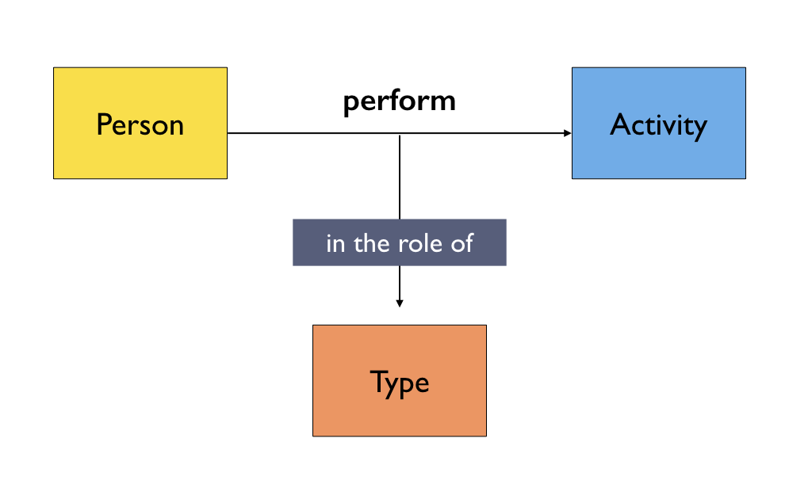
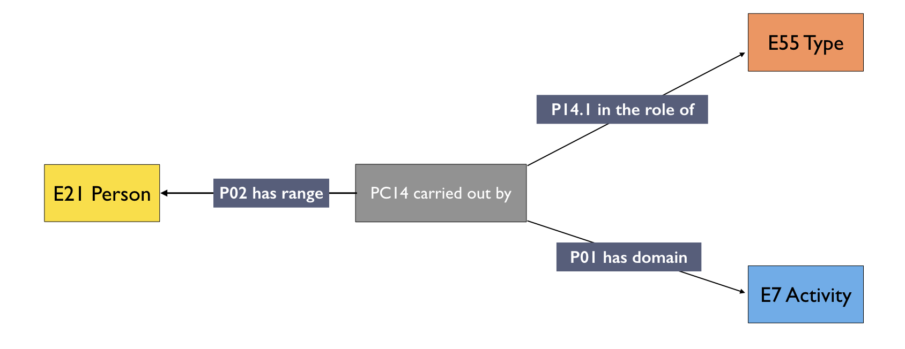

# General Pattern

*Introduction*

The document outlines modelling choices in relation to attributive patterns used across all of the CIDOC-CRM ontology, such as appellations, notes or roles. The modelling of such type of statements are going to be described in this section.

The modelling choices are recorded as generalisable patterns. Each pattern is made explicit using an example which it is both encoded in [RDF](https://www.w3.org/TR/rdf11-mt/) using [Turtle](https://www.w3.org/TR/turtle/) and presented, below each codebox, in a graphical form. 

All the prefix used within the document can be found on [http://prefix.cc/](http://prefix.cc/).

## Type

The class E55 Type denote concepts (not names, for those see [Appellation](#appellation)), preferably from a controlled source, used to classify a thing.
The modelling of a Type is a pretty straightforward one:

**E1 CRM Entity → P2 has type → E55 Type**{.modelling}  

The string of characters used in the type is modelled as:

**E1 CRM Entity → P2 has type → E55 Type → rdfs:Label → rdfs:Literal**{.modelling}  

In the example below we used a term from the [Getty Art and Architecture Thesaurus](http://www.getty.edu/research/tools/vocabularies/aat/) to classify the object "work/7761" as a type of painting [paintings (visual works) in AAT](http://vocab.getty.edu/aat/300033618).

**Codebox 1 . Type**. Click [here](https://gist.github.com/ncarboni/4b0008d1b080690b3e259c4bb41d73d5#file-type-ttl) to comment the modelling.

## Appellation

An appellation is a sign, usually in the form of a string of characters, used for referencing an entity (e.g. a person, an object, a place, en event). More appellations can refer, in the same language, to the same entity, and can also be tied to a specific time interval.

A simple appellation can be modelled in CRM as

**E1 CRM Entity → P1 is identified by → E41 Appellation**{.modelling}

While the string of characters used in the appellation is modelled as:

**E1 CRM Entity → P1 is identified by → E41 Appellation → rdfs:Label → rdfs:Literal**{.modelling}

A type, preferably from a controlled vocabulary, can be used to define the diverse appellations which we assign to an entity. 

**E1 CRM Entity → P1 is identified by → E41 Appellation → P2 has type → E55 Type**{.modelling}

In our case we chose to use the [Getty Art and Architecture Thesaurus](http://www.getty.edu/research/tools/vocabularies/aat/) which can provide us with diverse qualifiers. An example is in the Codebox 1, where we modelled a person surname, name and full name using the URI of the thesaurus as E55 Type. While in the example we used the entity E21 Person, the same pattern can be used across all the entities expressed in CIDOC-CRM.

**Codebox 2 . Appellation**. Click [here](https://gist.github.com/ncarboni/0ef99d3e520a7496f8dd357dddd000fd#file-appellation-ttl) to comment the modelling.

The exact same pattern can be used to model preferred and not-preferred names. As before, the use of a controlled vocabulary like the [Getty Art and Architecture Thesaurus](http://www.getty.edu/research/tools/vocabularies/aat/) (see the [preferred](http://vocab.getty.edu/aat/300404670) and [not-preferred](http://vocab.getty.edu/aat/300264273) terms) would help us normalise this field.

## Identifier

An identifier is a string assigned to an entity that uniquely identifies it in a system (usually, a digital system). Being a subclass of E41 Appellation, the modelling of the identifier in CRM is quite similar:

**E1 CRM Entity → P1 is identified by → E42 Identifier**{.modelling}

While the string of characters used in the identifier is modelled as:

**E1 CRM Entity → P1 is identified by → E42 Identifier → rdfs:Label → rdfs:Literal**{.modelling}

As seen in the [Appellation](#appellation) a E55 Type, preferably from a controlled vocabulary, can be used to define the diverse appellations. We will not repeat the modelling here because it would be redundant.

In the example below we used the entity E21 Person, but the same pattern can be used across all the entities expressed in CIDOC-CRM.

**Codebox 3 . Identifier**. Click [here](https://gist.github.com/ncarboni/056db4166af499a2a4424b2d04e8ef1c#file-identifier-ttl) to comment the modelling.

## Roles

The type of agency within an activity is an ontologically complicated matter and its representations within the RDF version of CIDOC-CRM has been a long object of debate in the past. The problem lies on the fact that CIDOC-CRM use the ".1" property to qualify the type of agency in a relationship (see Figure 1 below). While this approach would flawlessly work in a property graph, or in other Knowledge Representation Systems, it does not translate entirely well in RDF (*for more information see the debate on reification*).

{: width=500}

**Figure 1. Property Graph**. 

In order to resolve the issue the RDF version of CIDOC-CRM uses an [n-ary relationship](https://www.w3.org/TR/swbp-n-aryRelations/), therefore, representing the relationship as a class rather than a property, and then assign to this class an E55 Type. It is easier than it seems. Figure 2 below show a graphical representation of what we mean

**Figure 2. N-Ary relationship**.

This make easier to clarify the the type of agency within an activity. 
In order to demonstrate the modelling we will use one of example of ".1" property, "P14.1 carried out", but their modelling is substantially the same (it changes of course the type of properties that can be used).

**PC14 Carried Out By → P02 has range → E21 Person**{.modelling}  
**PC14 Carried Out By → P01 has domain → E7 Activity**{.modelling}   
**PC14 Carried Out By → P14.1 in the role of → E55 Type**{.modelling}   

We heavily used this construct to define the curation activities, as in the codebox below

**Codebox 4. Roles in an activity**. Click [here](https://gist.github.com/ncarboni/c07196571bda976249a44042d3c49007#file-roles-ttl) to comment the modelling.

As it can be seen in the Codebox above, we used the PC property which are not expressed in the RDF version of CIDOC-CRM, but they require an extension called "CRM-PC" available in the [resource page of the official website](http://www.cidoc-crm.org/versions-of-the-cidoc-crm).

## Notes

Notes are one of the most widespread and essential part of a KOS. Their modelling could be very easy, with a simple:

**E1 CRM Entity → P3 has note → rdfs:literal**{.modelling}

However, sometimes it is important to make explicit the type of note we are referring too. In order to do so, we would have again to use the [n-ary relationship](https://www.w3.org/TR/swbp-n-aryRelations/) construct (*see [roles](#roles) above*) with the CRM-PC extension. In this case the modelling would be 

**PC3_has_note → crm:P3.1_has_type → E55 Type**{.modelling}  
**PC3_has_note → crm:P03_has_range_literal → rdfs:Literal**{.modelling}   

We used this construct to qualify diverse notes which had to be interpreted differently by the machine, therefore the example below here is a bit cryptic, but still quite explicative.

**Codebox 5. Notes**. Click [here](https://gist.github.com/ncarboni/2b532a219bb3f81be2d02ef8f34c4b64#file-notes-ttl) to comment the modelling.

