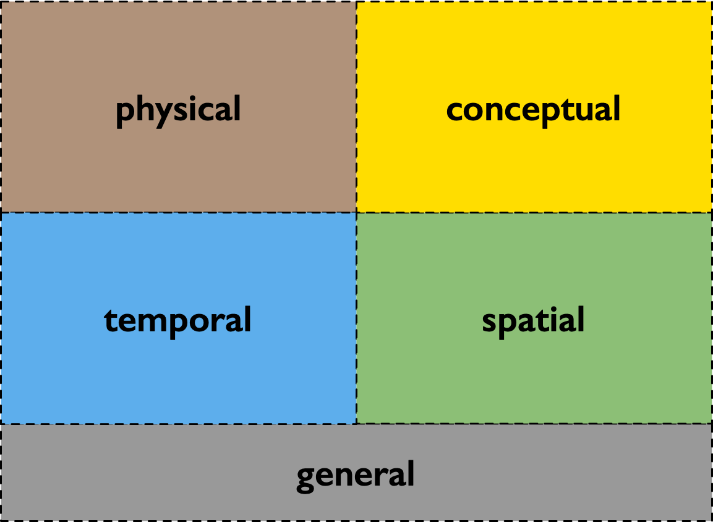

# Instruction

The Ontological Modelling Patterns presents a series of generalisable patterns that can be used to model information with CIDOC-CRM in RDF. The section it is divided into five subsections (Figure 1), presenting each a diverse domain covered by CIDOC-CRM:

- General
- Temporal
- Physical
- Spatial
- Conceptual

The **general patterns** section documents modelling which can be used across all the ontology, such as notes, appellations or types.  

The **temporal patterns** cover the modelling about the temporal dimension, such as time or events.  

The **physical patterns** focus on modelling of physical things, such as object or persons.   

The **spatial patterns** section documents the modelling of spatially related objects, such as places.  

The **conceptual patterns** focus on the conceptual side of an entity, such as their representation or information value.  

The diverse subsection should not be seen as watertight container, but only as very loose categories needed here to just divide and organise the patterns themselves. 
   

{: width=500}

 

